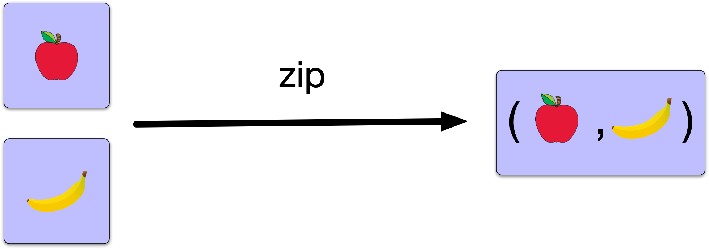

# Applicative

## Introduction

> Applicatives are useful when dealing with **multiple independent** effectful values

We have just seen that `Functor` allows us to abstract the composition pattern for one effectful value.
That pattern being the ability to transform the "wrapped" value, by applying a function. However, often we will have multiple
effectful values in our programs, and want to combine them. `Applicative` provides us with a way to combine two effectful values
that are independent. 

The core operation is called `zip` in our implementation, and takes an `F[A]` and an `F[B]` and tuples the inner values
to create `F[(A, B)]`. Essentially it "runs" both the `F[A]` computation and the `F[B]` computation and tuples the results.

For example

```scala
Defined("abc").zip(Defined("def")) // Defined(("abc", "def"))
Defined("abc").zip(Undefined)      // Undefined
```

Notice that in the above example we are composing two effectful `Maybe` values, additionally we are retaining the 
additional semantics added to the composition by the `Maybe` effect. We are using the "definedness" semantics encoded
by the `Maybe` data type, so if either argument to `zip` is `Undefined` then the result is also `Undefined` 



The definition of `Applicative` looks like this. Note that this is a **typeclass** that acts on a **type constructor** `F[_]`

```scala
trait Applicative[F[_]] {
   def pure[A](a: A): F[A]
   def zip[A, B](fa: F[A], fb: F[B]): F[(A, B)]
}
```

Notice there is also a function called `pure` defined. It wraps a a concrete value into the `F[_]` effect
in a trivial way. For example `(a: A) => Defined(a)` for our `Maybe` data type. 

## Read The Code

- In [`applicatives.scala`](../src/main/scala/part2/applicatives.scala) the `Applicative` trait has been defined.

- Similar to the previous section, an `implicit class` has been defined to provide dot syntax.

- Notice that `Applicative` extends `Functor`. This is because in the traditional encoding of `Applicative`, `Functor.map`
  can be implemented in terms of the primitive operation `ap`. In our encoding we have used `zip` as the primitive operation
  instead, since it is easier to understand, and `zip` + `map` are equally as powerful as `ap`. In fact, the `Applicative`
  type class we are using implements the traditional `ap` combinator using `zip` and `map`

## Exercises

**Exercise 1** &ndash; Maybe applicative
   - Implement an `Applicative` instance for `Maybe`
   - Run `ApplicativeLaws` using `sbt 'testOnly *ApplicativeLaws'` to check your implementation. 
     Note, there will still be some failing tests for `CanFail` applicative at this stage.

**Exercise 2** &ndash; CanFail applicative
   - Implement an `Applicative` instance for `CanFail`
   - Run `AppicativeLaws` using `sbt 'testOnly *ApplicativeLaws'` to check your implementation. 
     All the tests should pass now.

**Exercise 3** &ndash; Implement sequence
   - Implement the `sequence` function. If you are familiar with the `Future.sequence` method, this method 
     should look familiar. It does essentially the same thing, but in a much more generic way. Since it is
     more generic, it means we can use it for `List[CanFail]` and `List[Maybe]` or a list of anything
     that has an instance of Applicative.
     
     If you are not familiar with `Future.sequence` it takes a `Seq[Future[A]]` and returns a `Future[Seq[A]]`
     where the inner `Seq` of the resulting `Future` contains that result of each of the futures in the original
     `Seq`. 
    
     Tip: Start with an `F` of empty list, fold over `fas` adding the inner `A` to the list
          at each step. In your fold you should have an `F[List[A]]` as your accumulator
          and combine it with `F[A]` at each step.

**Exercise 4** &ndash; Use sequence
   - Implement the `asInts` function which converts a `List[String]` into a `List[Int]`
     in the `CanFail` effect, since converting a `String` to an `Int` can fail.
   - Run `ApplicativeSpec` using `sbt 'testOnly *ApplicativeSpec'` to check your implementation.
